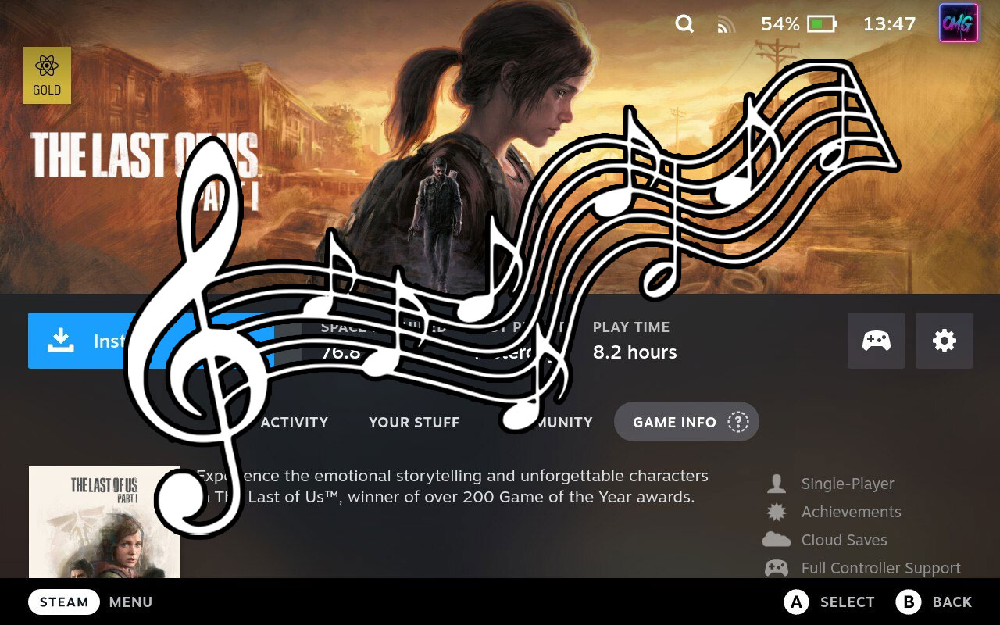

# Game Theme Music

Play theme songs on your game pages

## How it works

This plugin will find a games theme music based on the games name and play it in the background. An internet connection is required. It also supports non steam games.

## Decky Loader

This plugin requires [Decky Loader](https://github.com/SteamDeckHomebrew/decky-loader). Game Theme Music is available on the store.

## Steam Deck Homebrew Discord

## Contributors

<!-- readme: collaborators,contributors -start -->
<table>
    <tr>
        <td align="center">
            <a href="https://github.com/OMGDuke">
                
                 
                <b>OMGDuke</b>
            </a>
        </td>
    </tr>
</table>
<!-- readme: collaborators,contributors -end -->